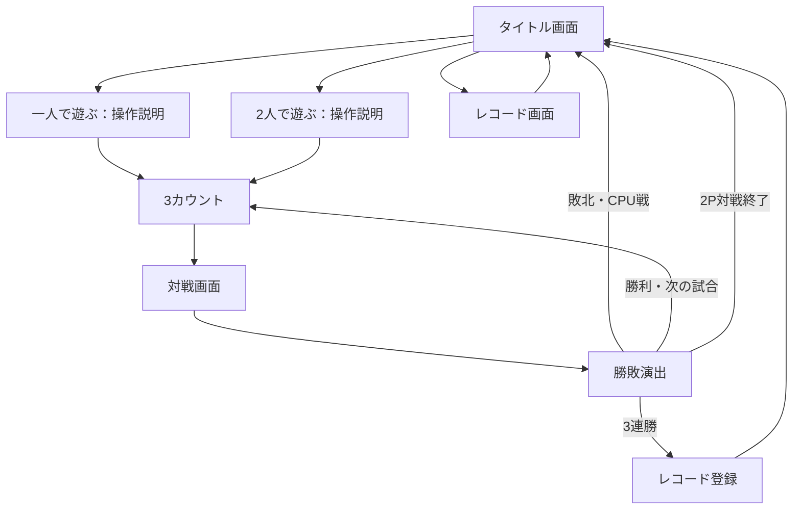

# 画面遷移図

```mermaid
flowchart TD
    A[タイトル画面] --> B[一人で遊ぶ：操作説明]
    A --> C[2人で遊ぶ：操作説明]
    A --> D[レコード画面]
    D --> A
    B --> E[3カウント]
    C --> E
    E --> F[対戦画面]
    F --> G[勝敗演出]
    G -->|敗北・CPU戦| A
    G -->|勝利・次の試合| E
    G -->|3連勝| H[レコード登録]
    H --> A
    G -->|2P対戦終了| A
```